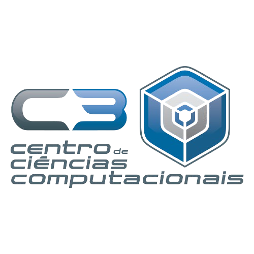

# Turma de SI 2025

    
    

 
Repositório criado com a finalidade de unir e organizar anotações dos alunos da turma de Sistemas de Informação 2025 a respeito das aulas ocorridas ao decorrer do ano letivo. Toda colaboração é bem-vinda!
