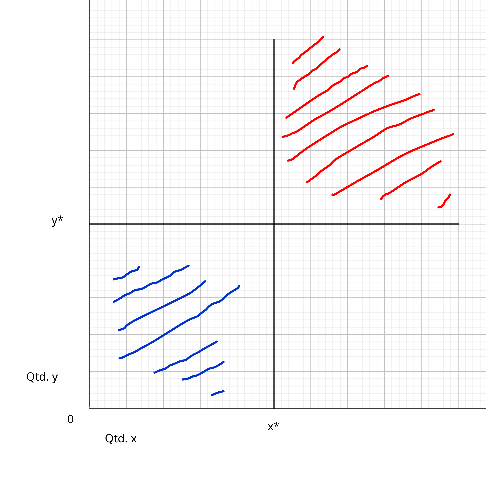
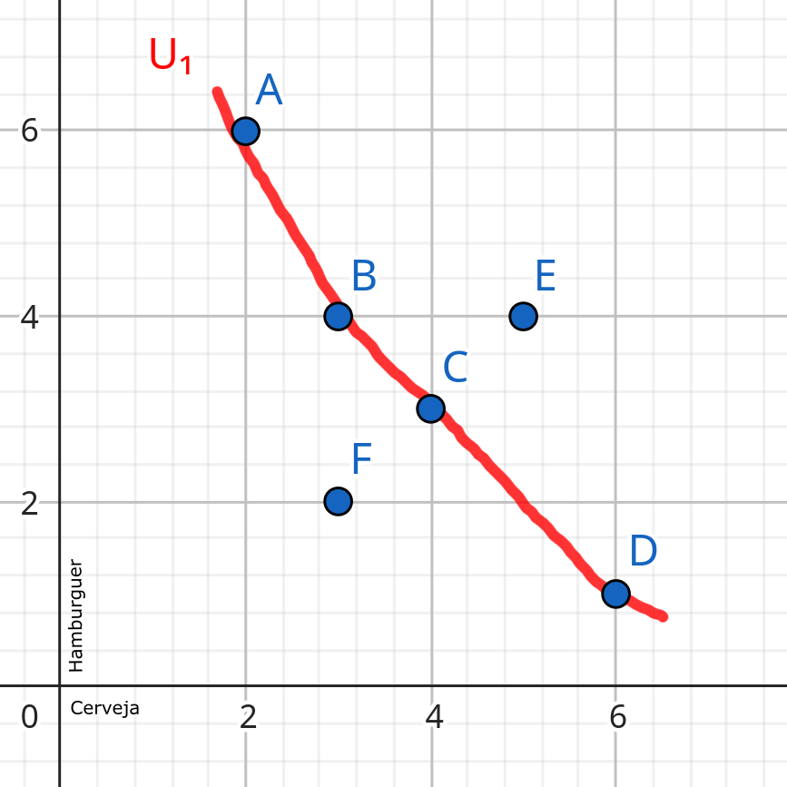
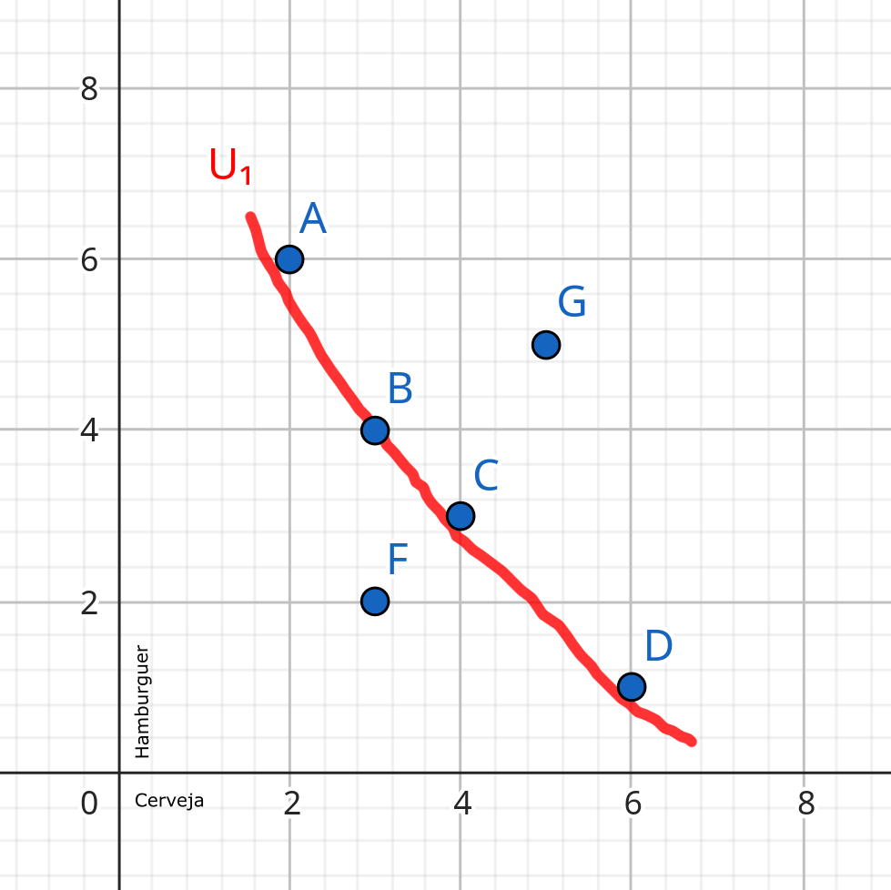
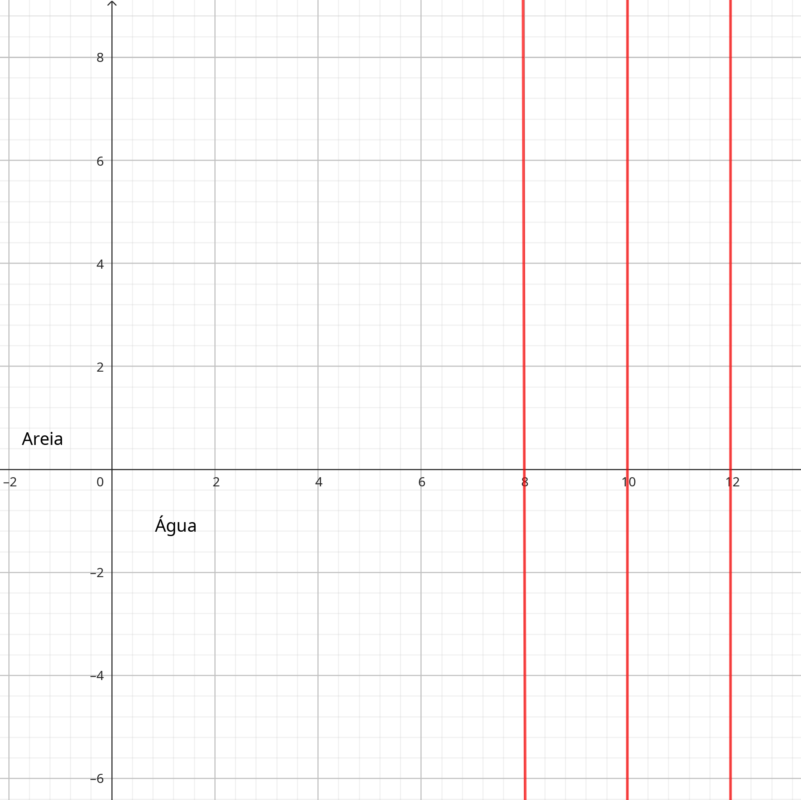
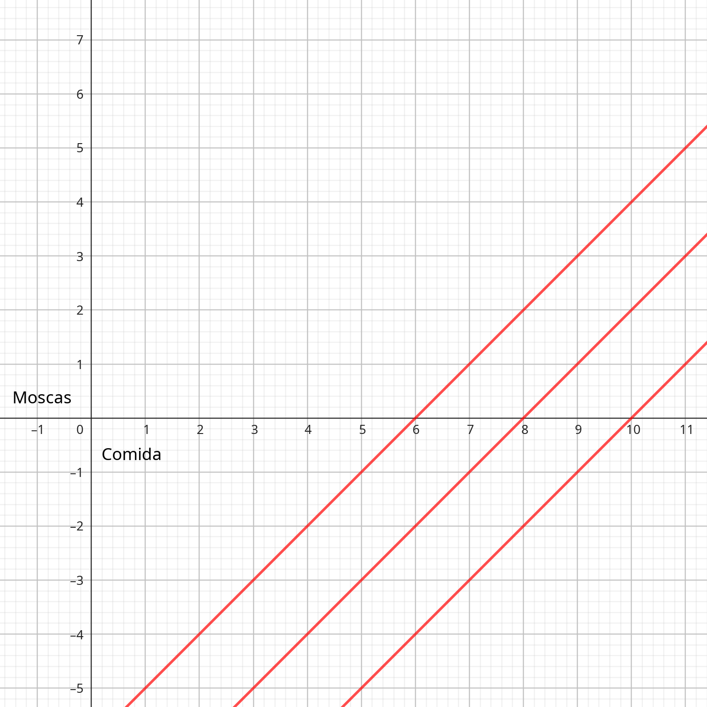
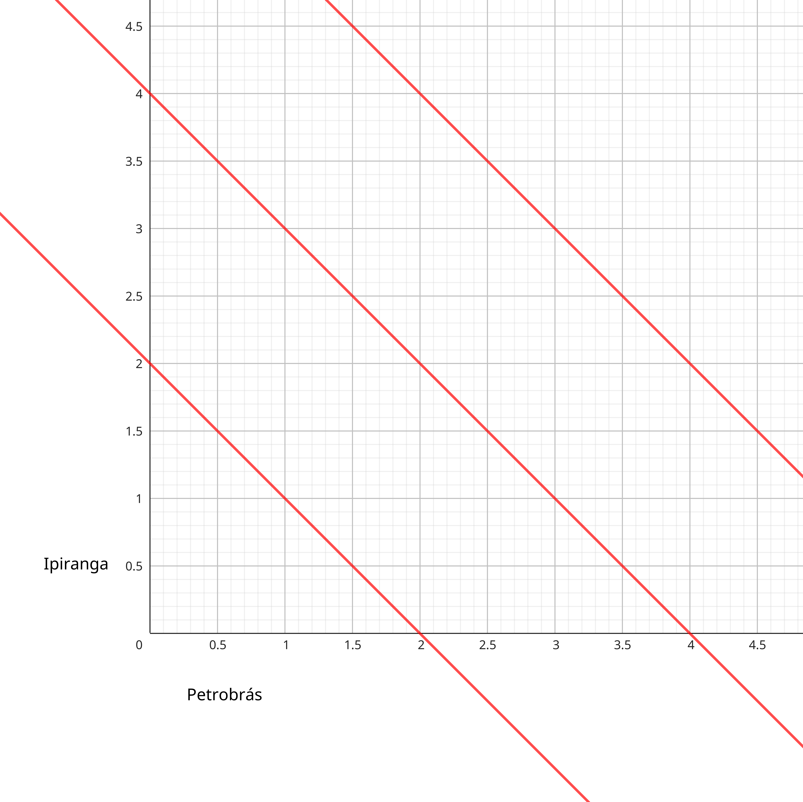
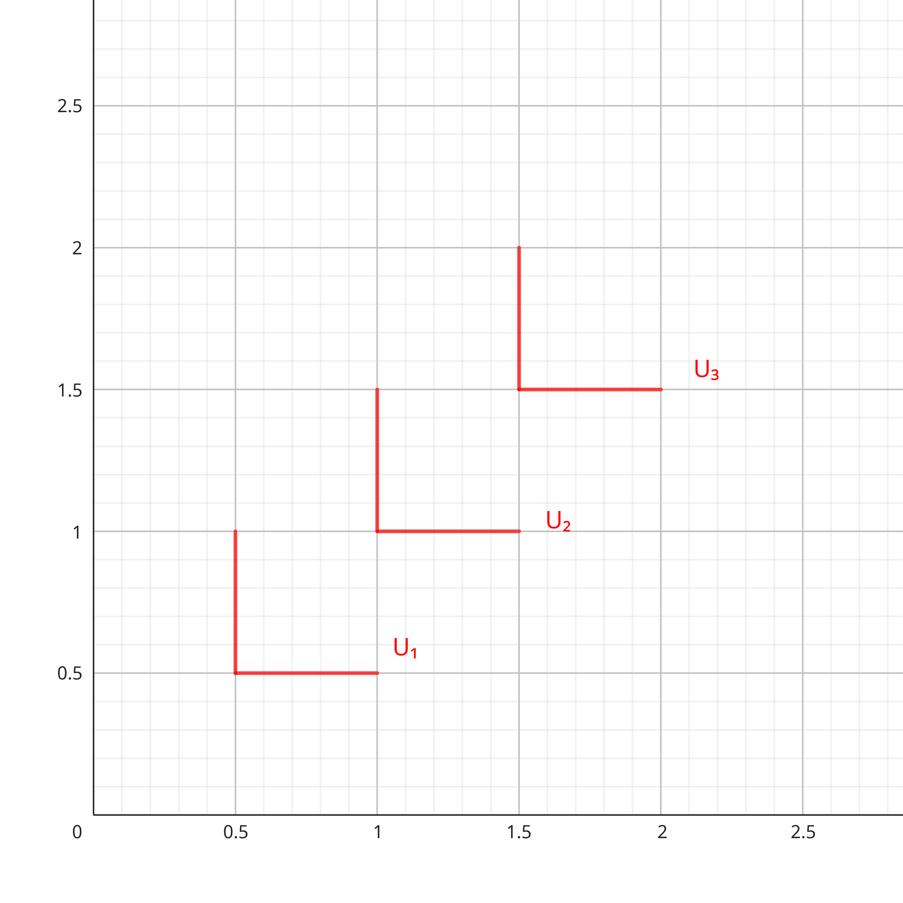

Aula 2; 03/04/2025

# Utilidade e Escolhas
## 1.1 Utilidade
A satifação que um indivíduo recebe de suas atividades econômicas.

### a) Ceteris Paribus
Simplificamos a análise de consumo de um indivíduo por assumir que sua satisfação é afetada apenas pelas escolhas entre os bens sendo considerada. Todos os outros efeitos na satisfação são consideradas constantes (Ceteris paribus).

### b) Utilidade no consumo de dois bens
Iremos assumir que um indivíduo recebe utilidade pelo consumo de dois bens, x e y.
Utilidade(x,y)

## 1.2 Pressupostos sobre as preferências
* Embasam a noção de que as pessoas fazem escolhas racionais e consistentes.

### a) Completa
Quando deparado com duas opções, um indivíduo pode sempre dizer qual prefere ou se prefere ambos de forma igual.

### b) Transitiva
Se uma pessoa diz que prefere A a B e que prefere B a C, então sabemos que ela prefere A a C (pela transitividade)

### c) Mais é melhor
Assumimos que uma pessoa sempre prefere mais de um bem do que menos.

Na figura 1, todos os pontos na área vermelha são preferidos a quantidades de x* do bem x e y* do bem y.

## 1.3 Trocas Voluntárias e Curvas de Indiferença (CI)
Queremos entender como as pessoas reagem quado têm de decidir entre ganhar mais de um bem por abrir mão de outro.

### a) Curvas de Indiferença (CI)
Mostra todas as combinações possíveis de dois bens que proporcionam o mesmo nível de utilidade para o indivíduo.

Na figura 2, U1 inclui todas as combinações de hamburguers e cerveja que fazem uma pessoa igualmente feliz. O ponto E (4 hamburguers e 5 cervejas) é preferido ao ponto C pois resulta em mais do dois bens.
Pela transitividade, E também é preferido a A, B e D.
A inclinação negativa da CI U1 indica que se o indivíduo abre mão de hamburguer, deve receber mais cerveja para se manter igualmente satisfeito.

### b) Curvas de Indiferença e a Taxa Marginal de Substituição (TMS)
A TMS indica a taxa na qual um indivíduo está disposto a reduzir o consumo de um bem quando recebe uma unidade a mais de outro bem.

Na figura 2, a pessoa abre mão voluntáriamente de 2 hamb. que estavam sendo consumidos no ponto A em troca de uma unidade de cerveja. A inclinação da CI U1 entre os pontos A e B é aproximadamente -2/1 = -2. O valor absoluto dessa inclinação é a TMS.

### c) TMS decrescente
A TMS varia ao longo da CI.
A para B -> -2/1=-2
B para C -> -1/1=-1
C para D -> -1/2=-0.5
A medida que andamos por U1 e a medida que o indivíduo vai recebendo mais cervejas ao preço de hamburguers ele fica cada vez mais relutante em ceder hamb. por cervejas. Então, a TMS declina de forma estável a medida que a quantidade de cervejas aumenta.

### d) Consumo Balanceado
A conclusão da TMS decrescente é que pessoas preferem cestas balanceadas a não balanceadas.

Considerando a cesta G que se encontra entre as cestas extremas A e D, todos os pontos de uma linha reta passam acima de U1. Dessa forma, contanto que a CI obedeca o pressuposto da TMS decrescente, ele terá o formato convexo, o que implica a preferencia por cestas variadas.

## 1.4 Mapa das CIs

Cada CI corresponde a um nível de utilidade diferente. 
Como cada combinação de H e C deve retornar um nível de utilidade, cada ponto precisa ter uma (e apenas uma) CI passando por ele.
Quanto mais para cima e para direita, maior o nível de utilidade .

## 1.5 Preferências Particulares
### a) Um bem inútil
Imagine um indivíduo perdido no deserto. Ele tem que escolher entre sacos de areia e garrafas de água.

A CI U2 , por exemplo, mostra que o nível de utilidade é alcançado por receber 10 garrafas de água, sem importar quantos sacos de areia hajam. Apenas mais garrafas de água aumentam a utilidade do indivíduo.

### b) Um Mal Econômico

Mantendo o número de comida constante em 10, a utilidade declina na medida que o número de moscas aumenta.

### c) Substitutos Perfeitos

Neste caso, o indivíduo é indiferente a trocar 1 litro de gas IPI por PETRO. A TMS é 1.

### d) Complementares perfeitos

Nenhuma utilidade deriva do consumo isolado de somente um lado do par.
