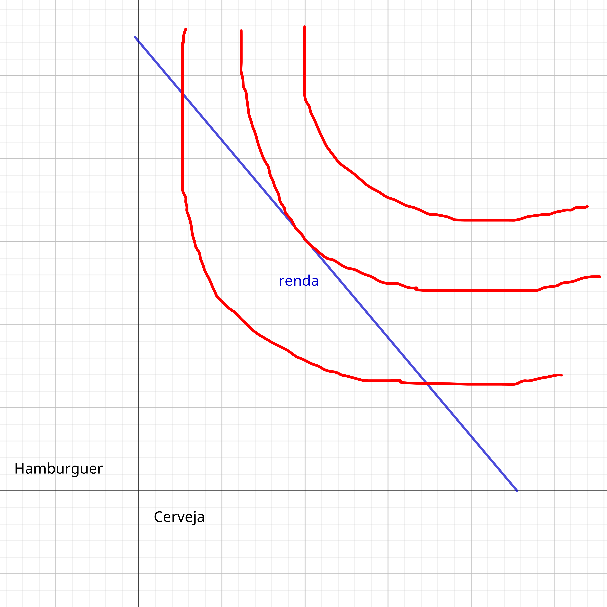
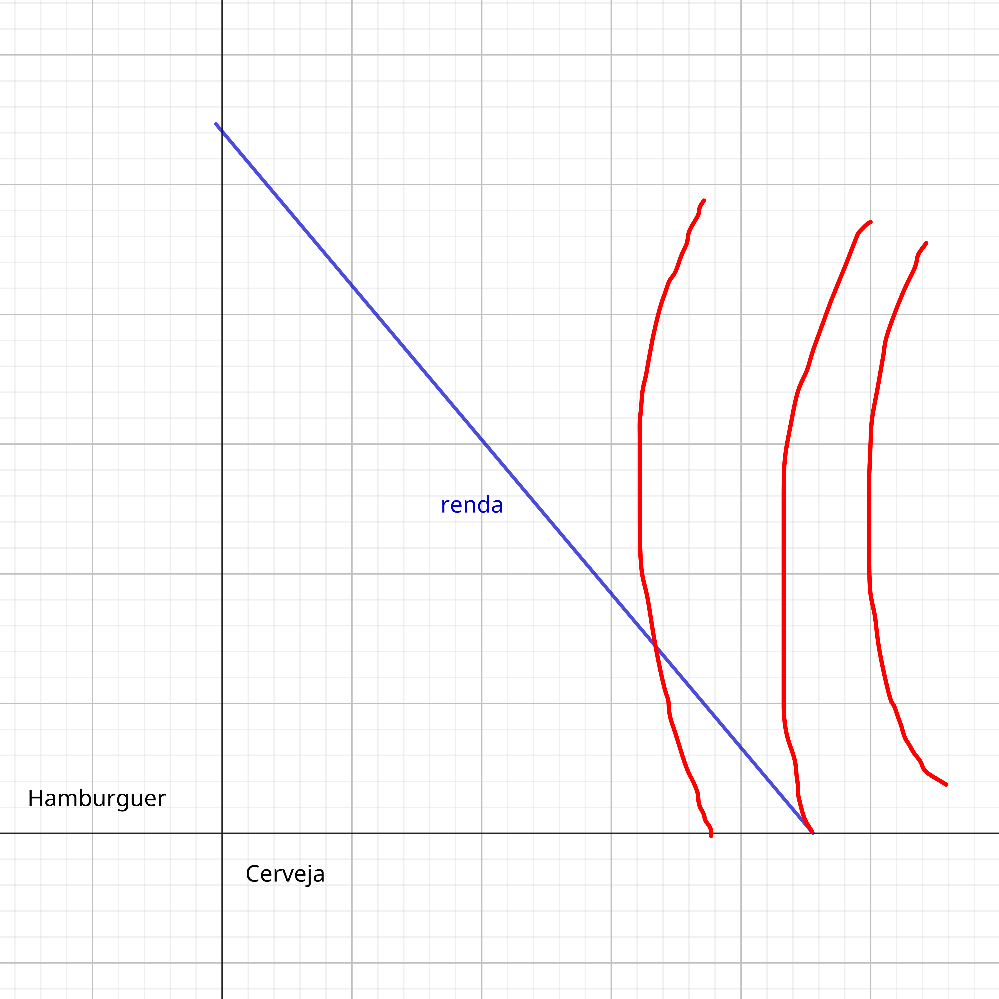
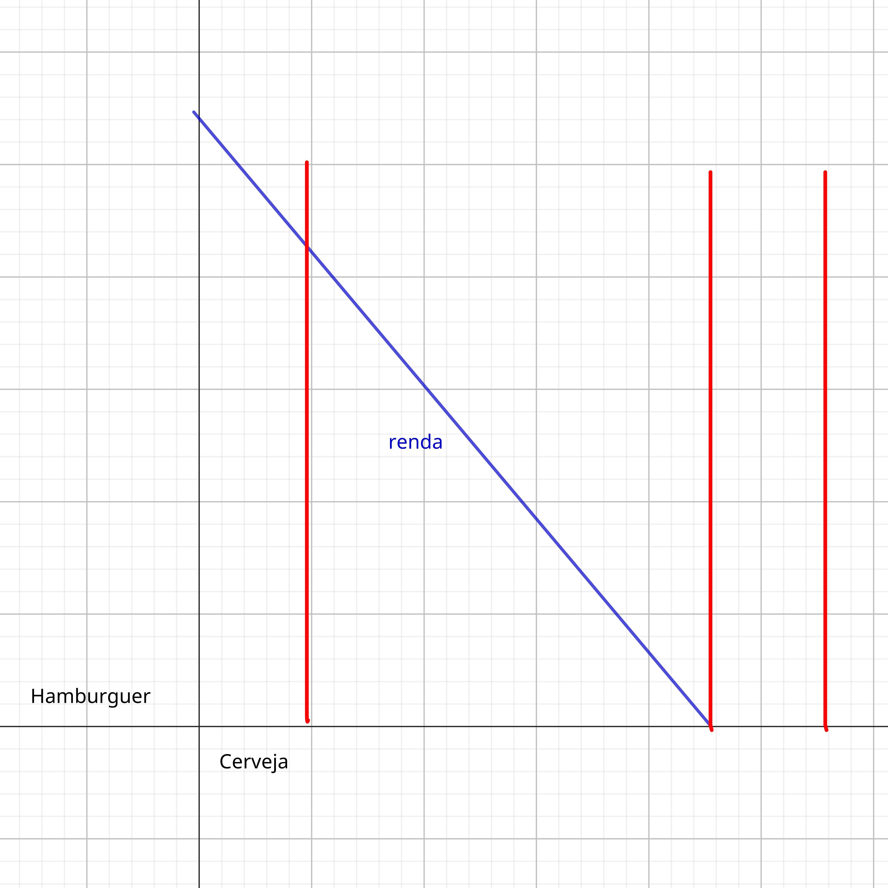
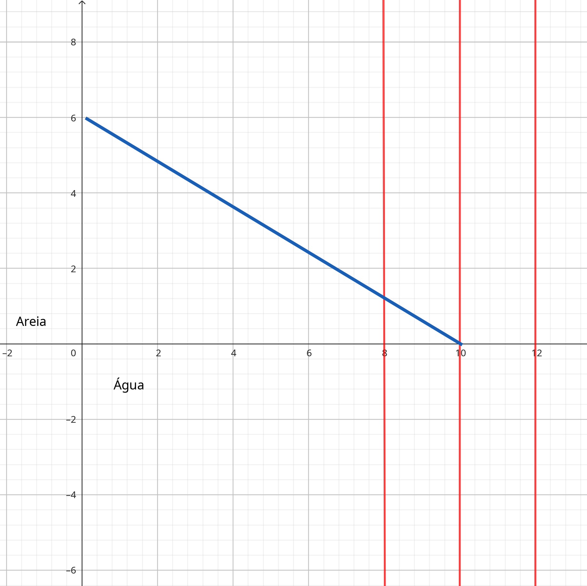
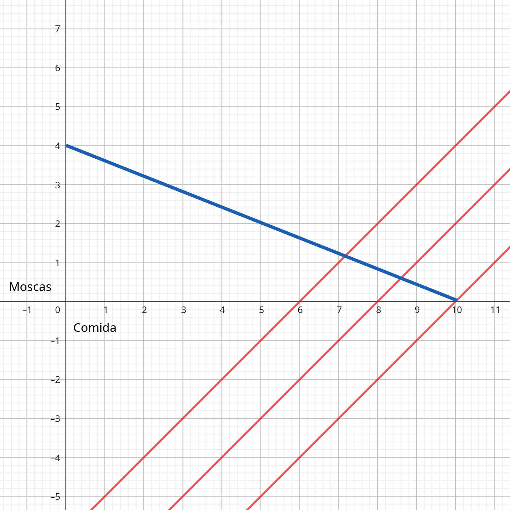
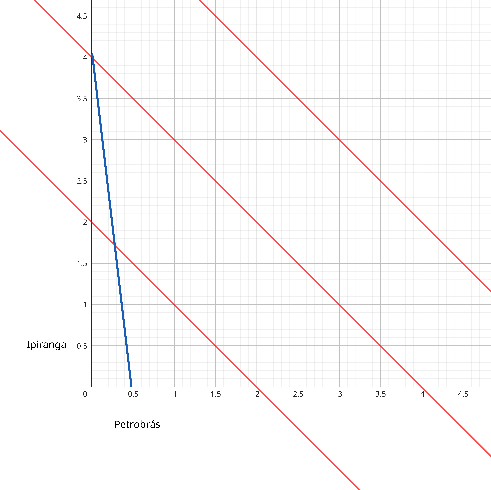
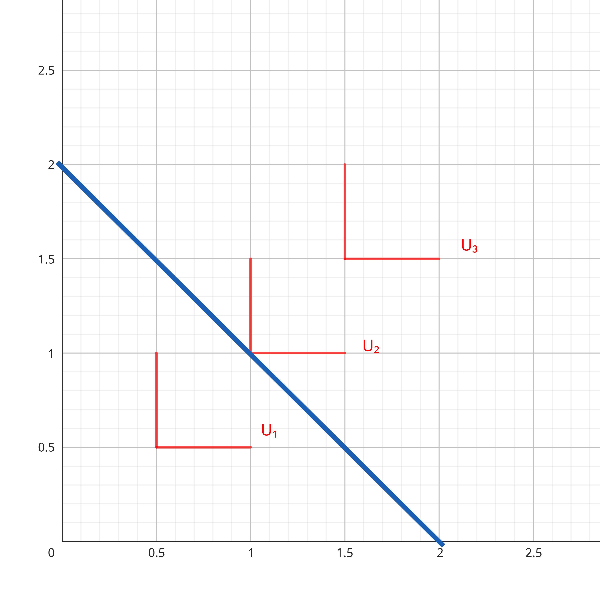

Aula 4; 10/04/2025

Partindo de onde parou na aula passada:
```math
\frac{Px}{Py} = TMS
```

>Uma forma alternativa de ver isso:

A utilidade marginal é a utilidade extra obtida pelo consumo de uma unidade a mais do bem x.\
Se o indivíduo se depara com a escolha de abrir mão de algum $y (Δy$) para ter um adicional $x (Δx$), a mudança na utilidade $ΔU$ é dada por: [^i]

$UMg$: Utilidade Marginal; $Δ$: Variação
```math
ΔU = UMgy.Δy + UMgx.Δx
```

Ela é igual a utilidade ganha pelo x adicional menos a utilidade perdida pela redução de y.\
Como a utilidade não muda ao longo da CI, temos: [^ii]\
```math
\Delta U = 0
\\
-UMgy.\Delta y = UMgx.\Delta x
\\
-\frac{\Delta y}{\Delta x} = \frac{UMgx}{UMgy}
```

Ao longo da CI, a inclinação negativa é dada por $\frac{UMgx}{UMgy}$. Isto é, por definição, a TMS.\
Temos então: [^iii]
```math
TMS = \frac{UMgx}{UMgy}
```

Então, se [^iU]
```math
	\frac{Py}{Px} = TMS = \frac{UMgx}{UMgy}
```
Para a maximização da utilidade, temos: [^U]
```math
UMgx/Px = UMgy/Py     
```

A razão da utilidade extra de consumir uma unidade a mais de um bem pelo seu preço deve ser a mesma para cada bem. Cada bem deve prover a mesma utilidade extra por real gasto. Se não fosse verdade, a utilidade total poderia ser aumentada por realocar fundos de um bem que provê um relativo baixo nível de UMg por real gasto, por outro que rendesse um nível maior.

Suponha que _utils_ seja a unidade de medida da utilidade. Suponha também, que consumir um hamburguer extra resulte em 5 _utils_ e consumir uma cerveja extra resulte em 2 _utils_. Suponha os preços Ph = $3 e Pc = $1,50. Então, cada _util_ custa $0,60 ($3/5) se hamburgueres são consumidos e $0,75 ($1,5/2) se cervejas são compradas.\
Claramente hamburguer é uma forma mais barata de comprar utilidade.
```math
\frac{UMgh}{Ph}>\frac{UMgc}{Pc}
```
De modo que essa pessoa deve aumentar o consumo de hamburguers e diminuir o consumo de cerveja até que cada bem seja um jeito _igualmente_ custoso de ter utilidade.

### 1.8 Usando o modelo de escolha

<div style="display: flex; flex-flow: row wrap; gap: 10px;">
	
	
	
</div>
<br>

A figura 11 ilustra porque pessoas com a mesma renda escolhem gastar de diferentes maneiras. Em todos os painei o RO (em azul) é a mesma, contudo em (a) nota-se preferencias por hamburguers, em (b) uma preferência por cervejas e em (c) apenas preferência por cerveja.

<div style="display: flex; flex-flow: row wrap; gap: 10px;">
	
	
	
	
</div>
<br>

> Painel

(a) O indivíduo só tem utilidade por consumir garrafas de água, independente da quantidade de sacos de areia.\
(b) O indivíduo tem preferências apenas por comida.\
(c) Os bens são idênticos, porém gasolina ipiranga é mais barata em relação a gasolina Petrobrás.\
(d) Os bens são complementares de modo que só retornam utilidade para o indivíduo se consumidos juntos.\
Em todos os casos o ponto de maximização respeita a RO.

> a) Exemplos

#### Subst. Perfeitos
Nesse caso, o consumidor decide gastar a rende no bem mais barato (se o custo for idêntico, ele é indiferente)

Considere bens substitutos perfeitos, mas não idênticos. Suponha que uma pessoa considere suco de laranja (A) e suco de uva (B) como subst. perfeitos para saciar a sede, mas cada copo de A provê 4 utils enquanto cada copo de B provê 3 utils. Nesse caso a função utilidade será: [^6]
```math
U(A,B) = 4A + 3B
```
Suponha que a pessoa tenha $30 para gastar nos bens, e que PA = $6 e PB = $5 são seus preços.
Se ela gastar tudo em A, 5 copos podem ser comprados ($30/6), e a equação (6) mostra o resultado de 20 utils dessa decisão (U(A,B) = 4.5 + 3.0)
Se a pessoa gastatudo em B, 6 copos podem ser comprados ($30/5), resultando em 18 utils (U(A,B) = 4.0 + 3.6). Então, A é a melhor compra após as diferenças na utilidade serem consideradas.   
```math
\frac{UMgA}{PA} > \frac{UMgB}{PB}
\\
\frac{4}{6} > \frac{3}{5}
```
(A) provê mais utilidade por real gasto.

[^i]: Equação "i"
[^ii]: Equação "ii"
[^iU]: Equação "iU"
[^U]: Equação "U"
[^6]: Equação "6"
