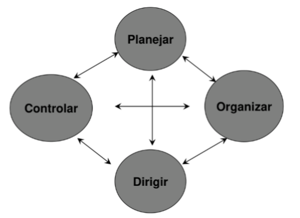
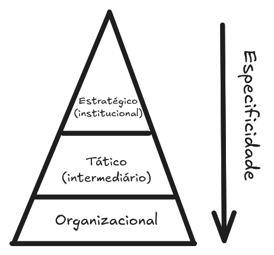

# Teorias
- Teoria da Administração Científica -> Taylor
- Teoria Clássica da Administração -> Fayol
- Teoria das Relações Humanas -> Mayo
- Teoria da Burocracia -> Weber

# Desenho do PODC

# Conceito de Administração
"Planejar, organizar, dirigir e controlar em todas áreas e níveis de uma organização, buscando sua eficiência e eficácia para alcançar seus objetivos."

# Função Planejamento
Tipos de Planejamento em cada nível organizacional.\

