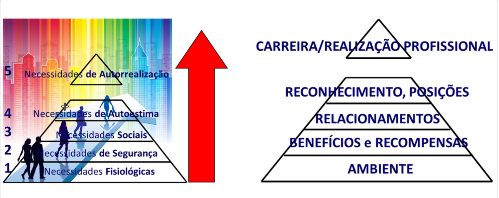

Aula 4; 11/04/2025

# Teoria Comportamental
- Ênfase no comportamento individual
- Estudo da motivação humana

> Teoria das necessidades de Maslow

 

> Teoria dos 2 fatores (motivacionais e higiênicos) de Herzberg

Não é necessário gerar satisfação, apenas NÃO gerar INSATISFAÇÃO já é um ganho.

- **Fatores de motivação (ou satisfação)**: responsabilidade, crescimento, conhecimento e reconhecimento.
- **Fatores de higiene (neutralizam a insatisfação)**: salário, condições de trabalho, relacionamentos, status, políticas etc.

# Teoria da Burocracia (1940)
Sociólogo e economista Max **Weber**: "Teoria Burocrática" (publicada postumamente)
- Burocracia pode ser definida por documentos movimentados de forma contínua através de vários componentes da estrutura organizacional
- A burocracia, quando bem implementada, gera eficiência
- Características principais:
    1. Caráter legal nas normas e regulamentos; 
    2. Formalidade nas comunicações;
    3. Divisão do trabalho;
    4. Impessoalidade;
    5. Meritocracia.

# Teoria Neoclássica (1950)
Austríaco Peter **Drucker**, considerado o pai da administração moderna, "guru da administração"

> Processo administrativo

<small>"PODC"</small>